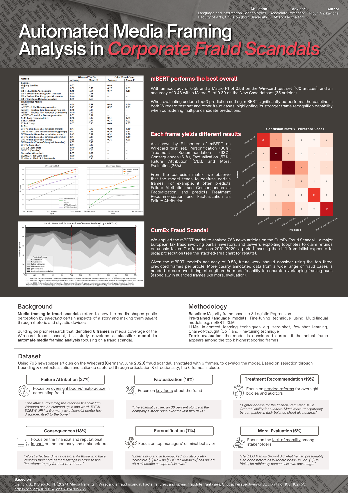

# 📰 **Automated Media Framing Analysis in Corporate Fraud Scandals**
## 📌 Description
A project focused on automating media framing analysis in corporate fraud scandals using transformer-based models and large language models (LLMs). Built on prior research and annotation from the Wirecard dataset, this project aims to understand how media frames influence public perception through rhetorical and stylistic strategies.

## 🎯 Objective

- **Accurate Framing Classifier**
  - Automate classification of news articles into six established media frames (e.g., Consequences, Failure Attribution, Moral Evaluation).
  - Address key research questions:
    - How do specific frames emerge and evolve during a scandal?
    - How does framing vary across media outlets or countries?

- **Multilingual and Generalizable Models**
  - Develop models that support multiple languages and generalize to unseen fraud cases.
  - Enable analysis in both high- and low-resource linguistic contexts.
  - Apply models to real-world fraud scandals such as:
    - **Wirecard Scandal (Germany, 2020)** – used as the annotated training set.
    - **CumEx Fraud (Europe, 2019–2020)** – model inference to analyze frame evolution over time.

## 🛠️ Tools & Technologies

- Transformer models: `mBERT`, `LLaMA 3.1`
- LLMs: `GPT-3.5`, `GPT-4o-mini`, `o1`
- Prompt engineering: Zero-shot, One-shot, Chain-of-Thought
- Fine-tuning: `LoRA`, `QLoRA`
- Libraries: Hugging Face Transformers, Scikit-learn
- NLP, Machine Learning, Python

## 🚀 Key Achievements

- Fine-tuned multilingual models and explored zero-shot LLM prompting strategies for media framing tasks.
- Demonstrated strong performance of `mBERT` for multilingual classification across diverse fraud cases.
- Applied `mBERT` to 768 articles on the **CumEx Fraud Scandal**, revealing frame dynamics during the shift from public exposure to legal prosecution.
- Showed that LLMs can offer interpretable reasoning and identify dominant/sub-dominant frames, supporting multi-label or annotation tasks.
- Proposed future improvements including paragraph-level tagging and frame aggregation to better capture multi-frame articles.
    

