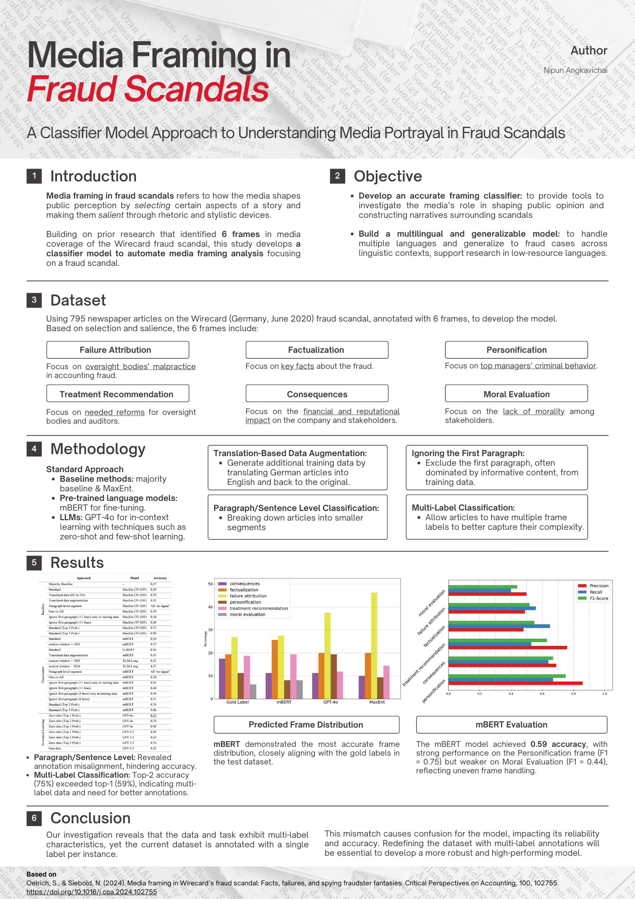

# 📰 **Automated Media Framing Analysis in Corporate Fraud Scandals**
   - **Description:** A project aimed at developing a machine learning classifier to automate media framing analysis, building on prior research in media framing related to Wirecard’s fraud scandal. This project focuses on how media shapes public perception through specific rhetorical techniques and stylistic devices.
   - **Objective:** 
     - **Accurate Framing Classifier**: 
       - Automate media framing analysis to enhance productivity and allow deeper insights into how events are portrayed by different media outlets.
       - Address key research questions, such as:
         - How do specific frames emerge and evolve during a scandal?
         - How does framing vary across media outlets?
     - **Multilingual and Generalizable Model**: 
       - Design a model capable of handling multiple languages and adapting to different fraud cases across linguistic contexts.
       - Enable analyses of fraud cases in low-resource languages.
       - Explore cases like:
         - **The Enron fraud (USA, October 2001)** – predominantly covered in English.
         - **The Parmalat fraud (Italy, December 2003)** – widely reported in Italian.
   - **Tools/Technologies:** Machine Learning, Natural Language Processing (NLP), Multilingual Models
   - **Key Achievements:**
     - Development of a machine learning classifier for media framing in fraud scandals.
     - Enabled multilingual analysis for varying cases across linguistic contexts.
    

